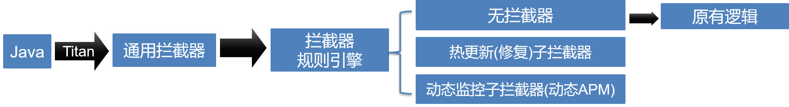
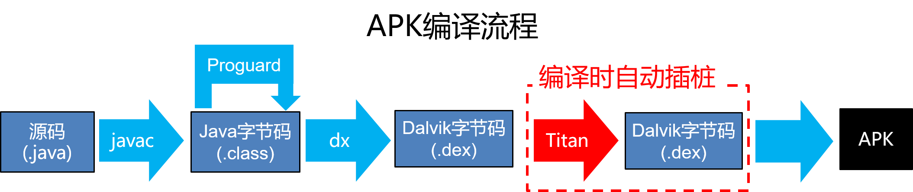
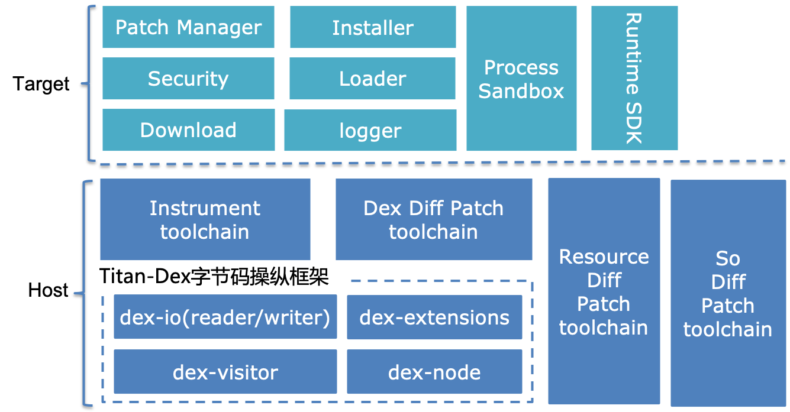

# Titan热修复技术概述 #

## 热修复的意义 ##
移动应用需要用户确认之后才能更新，线上版本发生严重问题后再走重新发版流程对用户体验伤害较大。
因此需要实现一套无需发版就能快速修复线上问题机制是十分有必要的。

## 热修复方案选型 ##
在Android平台上，热修复要实现Dex Code、Resource和Native Lib的动态更新。

Java语言是Android开发中的first-class语言，为了提升系统运行效率，基本每个版本Google都会对虚拟机做一些优化，
而Resouce和Native Lib的机制在Android各个版本基本没有变化，并且这两者的加载和运行也是Java代码来控制的。
因此Dex Code更新的实现是最复杂的，这里暂时先讨论Dex Code的热修复机制。

实现代码热修复的关键无非是做到动态更改代码的执行流程，或者说是更改代码执行的入口。

从代码执行入口角度来划分，目前的热修复解决方案有：

1、方法级别入口：在方法粒度实现代码更新。实现方案分为虚拟机Hook方法和Java插桩方案，前者通过Hook虚拟机的内部实现，实现方法的替换逻辑。后者是通过在每个方法中进行编译时插桩来实现方法的跳转逻辑，Titan轻量热修复就是通过该原理实现的。

2、DexClass和DexFile级别入口：在Android中代码的加载是通过ClassLoader来实现的，而ClassLoader会关联Dex Path list数组，
通过反射修改该数组内容，即可控制代码加载入口。

3、Android组件级别入口：在Android中有Activity、Service、Broadcast Receiver、Content Provider四大组件，还有Application入口，
这些都是通过在AndroidManifest清单中声明的，这五个是App自定义代码逻辑的入口，如果能够在这个入口级别通过对组件构造函数和生命周期方法进行插装实现代码的跳转逻辑，
就能够实现代码的全量更新。目前Titan全量热修复(beta)就是基于该原理来实现的，并且可以支持所有Android系统版本，并且无需任何隐藏API。如果从Android P开始可以考虑使用
AppComponentFactory机制实现全量热修复。
 
## Titan热修复方案实现细节 ##
 
### Titan热修复基本原理  ###
 
 在技术选型中，Titan热修复遵循的原则是尽最大可能保持兼容性，不使用任何隐藏API，所以选择了插桩的技术方案。
 
 以下是原始的代码逻辑
```
package com.baidu.foo;


public class A extends SuperA {
    public int intField;


    public int someMethod() {
        return intField;
    }
    
    public String otherMethod(String str, int i) {
        if (i == intField) {
            return str;
        }
        return null;
    }
}
```

首先定义Interceptable接口和InterceptResult:

```
package com.baidu.titan.runtime;

public interface Interceptable {
  
  InterceptResult invokeCommon(int methodId, Object thisObj, Object[] args);

  InterceptResult invokeV(int methodId, Object thisObj);

  InterceptResult invokeL(int methodId, Object thisObj, Object arg0);

  InterceptResult invokeLL(int methodId, Object thisObj, Object arg0, Object arg1);

  ...
 
 }

```


```
package com.baidu.titan.runtime;

public class InterceptResult {
    public boolean booleanValue;
    public byte byteValue;
    public short shortValue;
    public char charValue;
    public int intValue;
    public long longValue;
    public float floatValue;
    public double doubleValue;
    public Object objValue;
}
```

其中invoke-xxx方法支持多种参数列表，是根据实际多个APP大量统计而得出的，能够覆盖85%的参数组合，
还有InterceptResult中的字段也行也能支持各种基本类型和引用类型。这样能够避免box和unbox操作，提供性能，同时也能减少体积。

原始代码逻辑通过插桩之后，会变成类似于以下逻辑的伪代码：

```
package com.baidu.foo;


public class A extends SuperA {
    public static Interceptable $ic = null;
    public int intField;


    public int someMethod() {
         if ($ic == null) {
            label: orgCode
            return intField;
         } else {
            InteceptResult res = $ic.invokeV(1000, this)
            if (res == null) {
                goto orgCode
            } else {
                return res.intValue;
            }
         }
      
    }
    
    public String otherMethod(String str, int i) {
            if ($ic == null) {
                label: orgCode
                if (i == intField) {
                    return str;
                }
                return null;
            } else {
                InterceptResult res = $ic.invokeLI(1001, this, str, i);
                if (res == null) {
                    goto orgCode
                } else {
                    return (String)res.objValue;
                }
            
            }
    }
    
}
```
 
 如果com.baidu.foo.A.someMethod()逻辑有问题，需要修复，那么需要创建一下类
 
 ```
 package com.baidu.foo;
 
 
 public class A$iter implements Interceptable {
      InterceptResult invokeCommon(int methodId, Object thisObj, Object[] args) {
            reuturn null;
      }
    
      InterceptResult invokeV(int methodId, Object thisObj) {
            switch (methodId) {
                case 1000: {
                    return A$chg.someMethod((A)thisObj);
                }
            }
            return null;
      }
    
      InterceptResult invokeL(int methodId, Object thisObj, Object arg0) {
            return null;
      }
    
      InterceptResult invokeLL(int methodId, Object thisObj, Object arg0, Object arg1) {
            return null;
      }
    
 }
 
 ```
 
 ```
  package com.baidu.foo;
  
  
  public class A$chg implements Interceptable {
       
       int someMethod(A thisObj) {
             return thisObj.intField + 666;
       }
     
  }
  
  ```
 
 然后通过以下复制语句就可以完成方法级别的代码逻辑修改:
 
 ```
 A.$ic = new A$iter();
 ```
 
 这种修复方式通过适当扩展后，能够简单类级别的修复。通过在所有的方法中进行插桩，就可以实现一个拦截器原型，
 不但是可以修改代码逻辑，还可以实现无埋点日志和远程调试功能。
 
 
 
#### patch延迟加载 & 对&lt;clinit&gt;方法的插桩
patch加载时，需要将patch内的所有$iter类实例化，并赋值到对应类的$ic字段。但这样会在应用启动时将所有需要patch的类初始化，在一定程度上会影响应用启动速度。为了减少patch加载对性能的影响，设计了lazy init方案，在patch加载时，创建ClassClinitInterceptor实例并注入到ClassClinitInterceptorStorage.$ic字段，在类初始化时，首先调用ClassClinitInterceptorStorage.$ic.invokeClinit方法，获得对应的interceptor对象，注入到本类的$ic字段。
有两种情况不能使用lazy init:
1. 原类中未实现&lt;clinit&gt;方法
2. 修改的类有新增静态字段

&lt;clinit&gt;方法插桩后伪代码如下：
```
public class com.baidu.titan.sample.Main {

    public static Interceptable $ic = null;

    public void <clinit>() {
        if (ClassClinitInterceptorStorage.$ic == null) {
            label: orgCode
            // 执行原有代码逻辑
        } else {
            String typeDesc = "Lcom/baidu/titan/sample/Main;";
            int typeDescHash = hash(typeDesc);
            InteceptResult res = ClassClinitInterceptorStorage.$ic.invokeClinit(typeDescHash, typeDesc);
            if (res == null) {
                goto orgCode
            } else {
                if (res.interceptor != null) {
                    $ic = res.interceptor;
                }
                // INTERCEPT_RESULT_FLAG_INTERCEPTED标记类的<clinit>中发生了修改
                if (res.flags & Constant.INTERCEPT_RESULT_FLAG_INTERCEPTED) == 0) {
                    goto :origin
                }
                // 执行patch中的类初始化逻辑
                ClassClinitInterceptorStorage.$ic.invokePostClinit(typeDescHash, typeDesc);
            }
        }
    }
}
   
```

#### 对&lt;init&gt;方法的插桩
与其它方法相比，构造方法的区别是需要在方法中调用super.&lt;init&gt;()或者this.&lt;init&gt;()。因为&lt;init&gt;方法只能在本类中调用（见 [JVM Specification](https://docs.oracle.com/javase/specs/jvms/se7/html/jvms-4.html#jvms-4.10.1.9.invokespecial) 及 [Dalvik constraints B4](https://source.android.com/devices/tech/dalvik/constraints#struct-constraints)），如果如其它方法一样，直接将&lt;init&gt;方法copy到$chg类中，执行会导致崩溃，所以对&lt;init&gt;方法的插桩，分成了三步
1. 执行$ic.invokeUninit()，会调用到patch中$chg.instanceUnInit()，执行super.&lt;init&gt;或this.&lt;init&gt;之前的逻辑，并将所有寄存器状态保存下来
2. 执行super.&lt;init&gt;或者this.&lt;init&gt;，并传入执行第1步后更新的需要传给super.&lt;init&gt;或this.&lt;init&gt;的参数
3. 执行$ic.invokeInitBody(),会调用到patch中$chg.instanceInitBody(), 首先将第1步保存的寄存器状态恢复，然后执行super.&lt;init&gt;或this.&lt;init&gt;之后的逻辑

&lt;init&gt;方法插桩伪代码如下：
```
public class com.baidu.titan.sample.Main {

    public static Interceptable $ic = null;

    public void <init>() {
        if ($ic == null) {
            label: orgCode
            // 执行原有代码逻辑
        } else {
            InitContext context = TitanRuntime.newInitContext();
            Object[] paras = new Object[parasize];
            // 将<init>方法的参数拷贝到paras数组中
            ...
            context.initargs = paras;
            $ic.invokeUnint(methodId, initContext);
            if (initContext.flag & Constant.INIT_CONTEXT_FLAG_INTERCEPTED) == 0) {
                goto :origin
            }

            // call super.<init>或 this.<init>，并传入initContext.callargs
            super.<init>(initContext.callargs);
            InitContext.thisArg = this;
            $ic.invokeInitBody(methodId, initContext);
        }
    }
}
   
```

#### 对Field修改的支持
1. 非静态field修改，会引起&lt;init&gt;方法变化, 通过执行patch中的&lt;init&gt;逻辑实现
2. 静态field修改，会引起&lt;clinit&gt; 方法变化，通过执行patch中的&lt;clinit&gt;逻辑实现，有两种情况
    1. 原类中有&lt;clinit&gt;，不需要再做特别处理，走原插桩逻辑
    2. 原类中无&lt;clinit&gt;, 需要在PatchLoader中执行
3. static final field修改，视作新增field处理

#### 对Field新增的支持
在插桩时，向类中插入一个FieldHolder类型的字段$fd，当生成patch时，如果发现有新增field，在patch中创建FieldHolder的子类A$fdh, 将新增field添加到A$fdh中，并对所有引用该field的地方进行重写，重定向到A$fdh类中的field

以下为插桩后的示例伪代码：
```
public class com.baidu.titan.sample.Main {
    public static Interceptable $ic = null;
    public static FieldHolder $fd = null;

    public void foo() {
        return "foo"
    }
}
```
以下为新增field的伪代码
```
public class com.baidu.titan.sample.Main {
    public static Interceptable $ic = null;
    public static FieldHolder $fd = null;
    public String methodName;

    public <init>() {
        methodName = "foo";
    }

    public void foo() {
        return methodName;
    }
}
```
生成的FieldHolder类及chg类伪代码：
```
public class Main$fdh extends FieldHolder {
    public String methodName;
}

public class Main$chg{
    public static void initBody() {
        Main.$fd.methodName = "foo";
    }

    public static void foo() {
        return Main.$fd.methodName;
    }
}
```

#### 匿名内部类支持
匿名内部类在出现新增或者删除的情况下，有可能造成同一个类编译后类名出现变化，如：
```
public class A {
    private ExecutorService singleThreadPool = Executors.newSingleThreadExecutor();
    public void foo() {
        singleThreadPool.execute(new Runnable() {
            @Override
            public void run() {
                Log.d(TAG, "runnable 1");
            }
        });

        singleThreadPool.execute(new Runnable() {
            @Override
            public void run() {
                Log.d(TAG, "runnable 2");
            }
        });
    }
}
```
在编译后，会生成A$1和A$2两个匿名内部类。现在需要修改foo方法，修改后如下：
```
public class A {
    private ExecutorService singleThreadPool = Executors.newSingleThreadExecutor();
    public void foo() {
        singleThreadPool.execute(new Runnable() {
            @Override
            public void run() {
                Log.d(TAG, "runnable 1");
            }
        });
        Person alice = new Person("Alice", 1, 23, "titan-1234") {
            @Override
            protected String getBirthYear() {
                return super.getBirthYear() + " in anonymous";
            }
        };
        singleThreadPool.execute(new Runnable() {
            @Override
            public void run() {
                Log.d(TAG, "runnable 2");
            }
        });
    }
}
```
修改后的代码编译后，会生成A$1, A$2, A$3三个匿名内部类，其中的A$1未改变，A$3对应原A$2，而A$2为新增类<br>
从这个例子可以看出，在进行匿名内部类的diff时，如果仍是通过类名找到旧包中的类进行对比，是行不通的。

对匿名内部类的对比方法如下：
1. 按照outclass对匿名内部类进行分组对比
2. 对比同名类，检查是否有变更，无变更的标记为unchange
3. 迭代对比非同名类，对比前对类进行归一化变为同名类，检查是否相同，如果相同，标记为change并将两个类进行类型映射
4. 再次迭代所有未标记的类进行对比，如果两个类的父类、接口一致，进行对比，并标记为变更并将两个类进行类型映射
5. 还未标记的类都标记为新增且需要重命名，会被重命名为原类名+$copy
6. 对嵌套匿名内部类进行递归对比


### Titan插桩实现技术选型

 下图是Android APK编译流水线图
  
   
  
  可以在Java源码、Class文件还有Dex文件格式上实现插桩方案，Robust方案采用的使用javassist工具，在类似于Java源码格式级别实现插桩逻辑。
  Titan热修复选择了难度最大的实现方式-在Dex字节码级别实现插桩，解决了Robust遇到的Proguard混淆问题，也在最终的插桩后的性能和体积上实现了最大的优化效果。
  目前业界并无成熟的Dex字节码操纵框架，比如asm-dex，自从2012年发布后就停止了维护，并且有不少bug。因此通过仔细研究Dex文件格式和字节码格式，
  实现了一个自己的字节码操纵框架Titan-Dex。
  
  Titan-Dex在API设计上有两种模式：基于事件(Visitor模式，支持职责连)访问和基于层次节点(node模式)访问，分为dex-api、dex-reader、dex-writer和dex-node等子类库。
  
  插桩过程中，通过字节码操纵框架，在体积和性能两个方面做了一系列优化：
#### 对性能优化 ####
```
  方法拦截判断使用类字段代替方法调用
  方法分发使用编译时整型常量
  寄存器分配、使用优化
  分支预测优化
  避免box/unbox
  ...
```
  
#### 对体积优化 ####
```
  紧凑组织字节码
  优化寄存器分配算法
  拦截器多参数重载
  ...
```
  
  
### Titan热修复软件栈 ###
 

  
